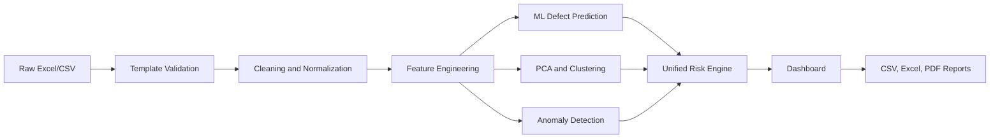

# Casting AI Platform - Project Overview

## Simple Explanation

Casting AI is an industrial quality monitoring platform for foundry melting and casting data. A user uploads an Excel or CSV file containing heat, chemistry, temperature, magnesium recovery, and process information. The platform cleans the data, creates metallurgy-based features, predicts defect probability, detects unusual process patterns, assigns risk levels, and generates engineering recommendations.

In plain terms: it helps engineers identify which heats or castings are likely to create defects before they become expensive quality problems.

## Technical Explanation

The platform is a Streamlit application backed by a staged machine learning pipeline:

1. `stage1_data_cleaning.py` cleans raw melting data and removes leakage columns.
2. `stage2_feature_engineering.py` creates metallurgical features such as CE, Mn/S ratio, temperature loss, shrinkage risk, gas risk, and chemistry instability.
3. `stage3_supervised_model.py` trains defect classifiers and saves the best model.
4. `stage4_pca_clustering.py` performs PCA and KMeans clustering to discover process families.
5. `stage5_anomaly_detection.py` detects unusual batches using Isolation Forest and LOF during offline training.
6. `dashboard/pipeline.py` runs inference for uploaded data.
7. `dashboard/risk_scoring.py` combines ML probability, anomaly score, cluster history, and metallurgical rules into final recommendations.

## Business Explanation

Foundry defects are expensive because they waste metal, furnace time, machining effort, inspection effort, and delivery capacity. A missed defect can also damage customer trust. Casting AI supports earlier decision-making by showing:

| Business Question | Platform Output |
|---|---|
| Which batches need immediate attention? | `risk_level`, `recommendation`, `final_risk_score` |
| Why was a batch flagged? | `risk_factors`, `qa_summary`, feature explanations |
| Are defects related to chemistry or process drift? | Feature importance, correlation heatmaps, cluster profiles |
| Is the batch unusual compared with history? | `anomaly_score`, `anomaly_severity` |
| Can reports be shared? | CSV, Excel, and PDF exports |

## Problem Statement

Melting departments generate large process logs, but defect risk is usually reviewed manually after production. Manual review can miss interactions between chemistry, temperature loss, magnesium treatment, sulfur, inoculation, and process timing. The project solves this by converting raw batch records into a decision-support dashboard.

## Why Foundries Need This

Foundries need stable melting control because small changes in chemistry or temperature can cause shrinkage, gas porosity, cold shuts, hard spots, nodularity issues, and rework. Engineers also need explainable decisions, not only black-box predictions. Casting AI combines machine learning with foundry rule logic so the output is understandable to seniors, shop-floor engineers, interviewers, and reviewers.

## Why AI Is Useful

AI is useful because casting quality depends on many interacting variables. A single parameter may look acceptable, but a combination such as low CE, low Si, high temperature loss, high sulfur, and poor Mg recovery can create high risk. The classifier learns historical patterns, anomaly detection catches unusual behavior, and rule logic explains the industrial meaning.

## Key Features

| Feature | Description |
|---|---|
| Upload and Predict | Upload Excel/CSV and run the full inference pipeline. |
| Template Validation | Checks uploaded file against the master template. |
| Metallurgical Feature Engineering | Creates domain-specific risk features. |
| Defect Prediction | Predicts probability of defective casting. |
| Anomaly Detection | Flags process patterns that differ from historical behavior. |
| PCA and Clustering | Groups similar process behavior for comparison. |
| Unified Risk Scoring | Produces final risk level and recommendation. |
| QA Summary | Generates human-readable industrial explanation. |
| Dashboard Analytics | Shows fleet KPIs, charts, gauges, and comparison views. |
| Exports | Produces CSV, Excel, and PDF reports. |

## End-to-End Capability

## Audience-Specific Explanation

| Audience | Best Explanation |
|---|---|
| Senior management | The system reduces quality risk by identifying dangerous heats early and summarizing risk across the fleet. |
| Melting engineers | The system highlights process and chemistry causes such as CE, sulfur, Mg recovery, temperature loss, and gas/shrinkage indexes. |
| Interviewers | This is an end-to-end ML system: data cleaning, feature engineering, supervised learning, unsupervised learning, explainability, dashboarding, and exports. |
| Judges/reviewers | The project combines domain knowledge and ML into a usable industrial decision-support product. |
| Future developers | The code is organized into staged scripts, dashboard modules, model artifacts, and export utilities. |
