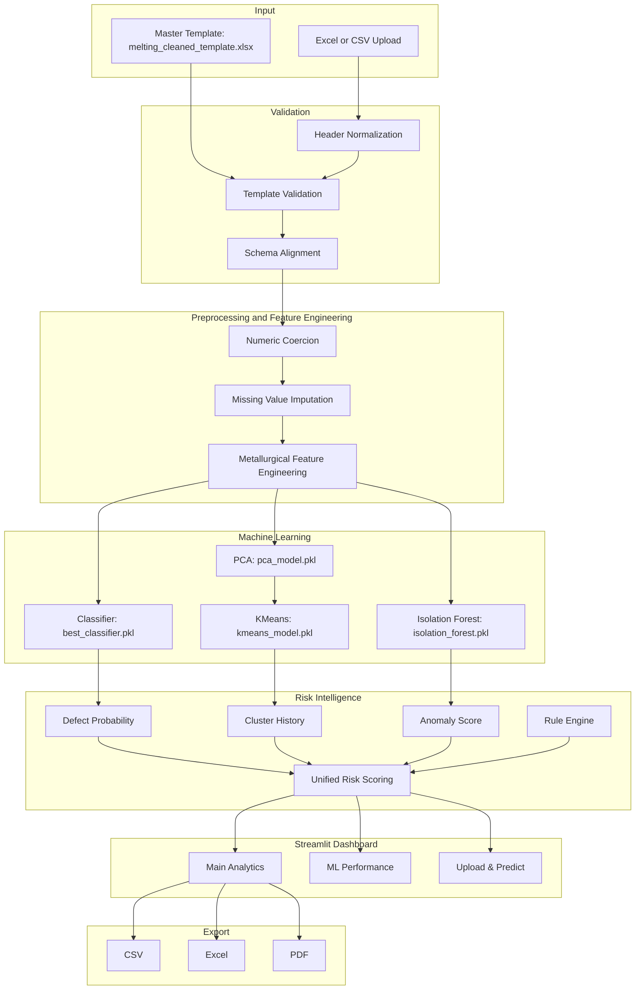
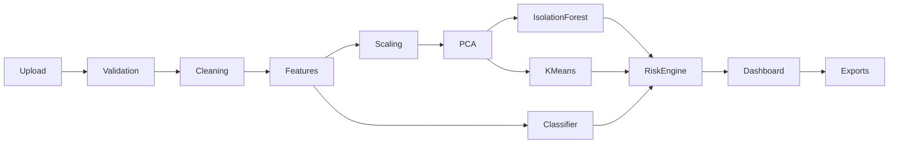

# System Architecture

## High-Level Architecture

Casting AI uses a layered architecture:

| Layer | Main Files | Responsibility |
|---|---|---|
| Data Layer | `melting_cleaned_final.xlsx`, `outputs/*.csv` | Raw, cleaned, engineered, clustered, and anomaly-enriched data. |
| Training Pipeline | `stage1` to `stage5`, `validation_and_kpi.py` | Offline model creation, validation, and artifact generation. |
| Model Artifacts | `models/*.pkl`, `models/*.json` | Saved classifier, scalers, PCA, KMeans, Isolation Forest, and feature schemas. |
| Dashboard Pipeline | `dashboard/pipeline.py`, `dashboard/preprocessing.py` | Runtime upload parsing, schema alignment, feature generation, and inference. |
| Decision Engine | `dashboard/risk_scoring.py`, `interpretation_rules.py` | Final risk, recommendation, confidence, risk factors, and QA summaries. |
| UI Layer | `stage9_streamlit_app.py`, `dashboard/pages/*.py` | Streamlit pages, charts, metrics, upload controls, and explanations. |
| Export Layer | `dashboard/exports.py`, `dashboard/unified_export.py` | CSV, Excel, and PDF generation. |

## Architecture Diagram

## End-to-End Processing Architecture

## Module-by-Module Explanation

| Module | Simple Meaning | Technical Role |
|---|---|---|
| `stage1_data_cleaning.py` | Cleans the raw sheet. | Standardizes columns, removes leakage, handles missing values, clips extreme outliers, writes cleaned CSV. |
| `stage2_feature_engineering.py` | Adds foundry intelligence. | Creates CE, CE risk flags, C/Si, Mn/S, Mg recovery, temperature, oxidation, graphitization, shrinkage, gas, chemistry stability, FSM, heel ratio features. |
| `stage3_supervised_model.py` | Trains defect model. | Compares Logistic Regression, Random Forest, Gradient Boosting, Extra Trees using ROC-AUC, recall, F1, and saves best classifier. |
| `stage4_pca_clustering.py` | Groups similar batches. | Standardizes numeric features, runs PCA to retain 90 percent variance, selects KMeans `k` by silhouette, saves cluster profiles. |
| `stage5_anomaly_detection.py` | Finds unusual process behavior. | Uses Isolation Forest and Local Outlier Factor offline; saves Isolation Forest for inference. |
| `interpretation_rules.py` | Converts numbers into engineering warnings. | Rule-based QA interpretation for sulfur, CE, Mg recovery, temperature, shrinkage, gas, AI probability, anomaly score. |
| `dashboard/pipeline.py` | Runtime pipeline. | Loads uploads, validates template, aligns feature schema, runs classifier/PCA/KMeans/Isolation Forest, enriches decisions. |
| `dashboard/preprocessing.py` | Upload safety layer. | Normalizes headers, applies aliases, bridges chemistry names, aligns model features, logs schema mismatch details. |
| `dashboard/risk_scoring.py` | Final decision source of truth. | Combines ML, anomaly, cluster stats, and rules into `risk_level`, `recommendation`, `final_risk_score`, and `risk_confidence`. |
| `dashboard/pages/main_analytics.py` | Main user workspace. | Upload, fleet KPIs, defect drivers, anomaly report, casting comparison, risk intelligence, single batch analysis. |
| `dashboard/pages/ml_performance.py` | Model validation page. | Shows metrics, confusion matrix, ROC, PR, feature importance, confidence distribution, business impact. |
| `dashboard/exports.py` | Page exports. | Generates CSV, Excel, and PDF reports. |
| `dashboard/unified_export.py` | Full report export. | Exports processed results, fleet summary, risk data, selected batch, top anomalies. |

## Folder and File Responsibilities

| Folder/File | Purpose |
|---|---|
| `dashboard/` | Streamlit dashboard package. |
| `dashboard/pages/` | Dashboard pages and page-specific logic. |
| `dashboard/config/features.py` | Feature schema and template sample helpers. |
| `dashboard/utils/` | Debugging and validation helpers. |
| `models/` | Pickled trained model artifacts and JSON feature schemas. |
| `outputs/` | Intermediate and final processed datasets. |
| `plots/` | Static evaluation and pipeline plots. |
| `requirements.txt` | Python dependencies. |
| `README.md` | Existing quick-start overview. |

## Important Runtime Artifacts

| Artifact | Used For |
|---|---|
| `models/best_classifier.pkl` | Production defect probability model. |
| `models/feature_columns.pkl` | Exact classifier feature order. |
| `models/feature_training_stats.pkl` | Median/default fill values for missing inference features. |
| `models/pca_model.pkl` | PCA transformation for clustering. |
| `models/pca_scaler.pkl` | Scaler used before PCA. |
| `models/kmeans_model.pkl` | Cluster assignment. |
| `models/isolation_forest.pkl` | Runtime anomaly detection. |
| `models/anomaly_scaler.pkl` | Scaler used before Isolation Forest. |
| `outputs/melting_with_anomalies_stage5.csv` | Preferred default dashboard dataset. |

## Design Principle

The system separates training from inference. Training creates trusted models and feature schemas. Inference strictly aligns uploaded data to those schemas before prediction. This prevents feature-order errors, missing-column crashes, and inconsistent dashboard decisions.
