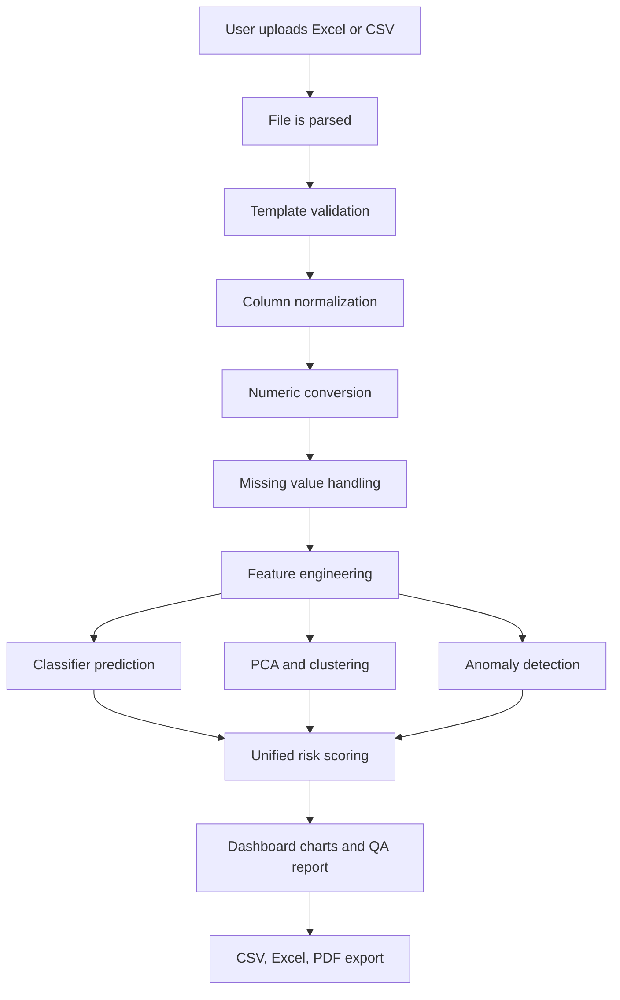
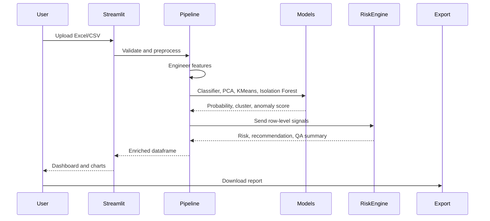

# Complete Workflow

## Overview

The complete workflow starts with a melting or casting log and ends with risk-aware dashboard reports.



## 1. User Uploads Excel/CSV

The user uploads a melting log through the Streamlit interface. The upload pages support `.xlsx`, `.xls`, and `.csv`.

Main functions:

| Function | File | Purpose |
|---|---|---|
| `inspect_upload_for_template` | `dashboard/pipeline.py` | Checks if uploaded headers match the master template. |
| `inspect_upload_file` | `dashboard/pipeline.py` | Runs preliminary schema validation. |
| `run_full_pipeline` | `dashboard/pipeline.py` | Executes the full prediction pipeline. |

## 2. Validation Happens

The platform compares uploaded columns with the master template. It uses normalized and semantic matching, so minor naming differences such as `pouring_temperature` and `pouring_temp` can map to the same concept.

Validation checks:

| Check | Meaning |
|---|---|
| Missing required template columns | The file may not contain the required process fields. |
| Extra columns | Allowed, but ignored unless useful. |
| Duplicate columns | Removed or deduplicated safely. |
| Schema alignment | Runtime features are aligned to trained model feature order. |

## 3. Columns Are Normalized

Column names are cleaned so the pipeline can treat inconsistent headers consistently.

Example transformations:

| Raw Header | Normalized Header |
|---|---|
| `Tapping Temp` | `tapping_temp` |
| `Pouring Temp` | `pouring_temp` |
| `Mg Recovery %` | `mg_recovery` or `mg_recovery_` |
| `DEFECTED` | `defect` |

## 4. Missing Values Are Handled

Missing numeric values are filled with medians or training medians. This is important because industrial logs often contain blanks, dashes, or inconsistent formatting.

Technical behavior:

| Stage | Method |
|---|---|
| Offline cleaning | Median imputation using `SimpleImputer`. |
| Runtime inference | Missing trained features are filled using saved training statistics. |
| Feature columns | NaN values in engineered features are filled with `0`. |

## 5. Features Are Engineered

The system creates domain-specific features from raw chemistry and process values. These features translate foundry knowledge into machine-readable signals.

Examples:

| Feature | Meaning |
|---|---|
| `feat_ce_calculated` | Carbon Equivalent from C, Si, and P. |
| `feat_temp_loss` | Tapping temperature minus pouring temperature. |
| `feat_mn_s_ratio` | Sulfur neutralization indicator. |
| `feat_shrinkage_risk_index` | Composite shrinkage risk. |
| `feat_gas_risk_index` | Composite gas porosity risk. |

## 6. Risk Indexes Are Calculated

Risk indexes summarize known physical risk mechanisms:

| Index | Industrial Meaning |
|---|---|
| Shrinkage risk | Low CE, low Si, or high pouring temperature can increase solidification shrinkage risk. |
| Gas risk | High nitrogen, excessive Mg, or charge moisture indicators can increase gas porosity risk. |
| Chemistry instability | Distance from ideal ranges for C, Si, Mn, Mg. |
| Temperature loss risk | Excessive heat loss can cause cold shuts and misruns. |

## 7. ML Prediction Runs

The saved classifier predicts `defect_prob`, the probability that a batch may be defective.

Runtime steps:

1. Load `models/best_classifier.pkl`.
2. Load expected features from `models/feature_columns.pkl` or `feature_names.json`.
3. Align upload features to training schema.
4. Run `predict_proba`.
5. Store `defect_prob`.
6. Store `defect_pred` using the classifier's default decision behavior.

## 8. Confidence Is Calculated

The final decision confidence in `dashboard/risk_scoring.py` is not the same as raw model probability. It is a decision confidence based on the number and strength of active risk signals.

Current formula:

```text
confidence = min(0.95, 0.45 + 0.18 * number_of_high_signals + 0.12 * number_of_risk_factors)
```

High signals include elevated defect probability, anomaly score, and cluster risk.

## 9. Risk Intelligence Is Generated

The unified risk engine combines:

| Signal | Source |
|---|---|
| Defect probability | Supervised classifier. |
| Anomaly score | Isolation Forest. |
| Cluster defect rate | Historical cluster profile. |
| Metallurgical warnings | Rule engine in `interpretation_rules.py`. |

Final fields:

| Field | Meaning |
|---|---|
| `risk_level` | LOW, MEDIUM, HIGH, or CRITICAL. |
| `recommendation` | PROCEED, MONITOR, HOLD, or STOP. |
| `final_risk_score` | 0-100 score based on the strongest risk signal. |
| `risk_confidence` | Confidence in the final decision. |
| `risk_factors` | Short reasons that triggered risk. |
| `qa_summary` | Engineer-readable QA report. |

## 10. Dashboard Is Visualized

The Main Analytics page shows:

| Section | Purpose |
|---|---|
| Data upload | Upload file and validate template. |
| Fleet overview | Overall quality, stability, defect probability, severity, recommendations. |
| Defect drivers | Top process/chemistry factors related to defects. |
| Anomaly report | Severity distribution and top anomalies. |
| Casting comparison | Selected batch vs healthy fleet average. |
| Risk intelligence | Cluster insights and QA explanation. |
| Single batch analysis | Detailed decision, gauge, process parameters, and report. |

## 11. Reports Are Exported

Exports are available as:

| Export | File |
|---|---|
| CSV | Full processed rows. |
| Excel | Processed results, fleet summary, risk/anomaly sheets, selected batch, top anomalies. |
| PDF | Executive report and selected batch QA narrative. |

## Complete Lifecycle Summary


