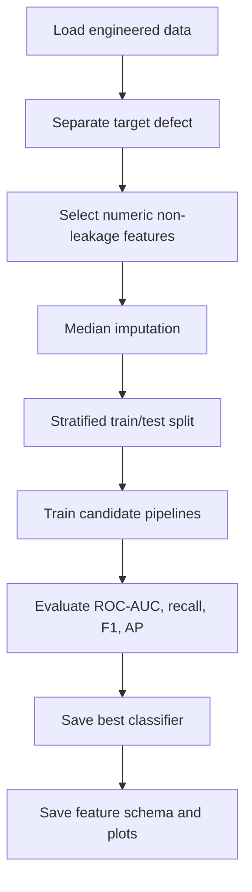
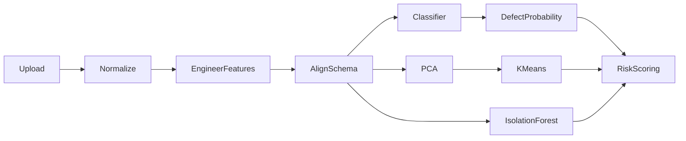

# ML Pipeline Documentation

## Pipeline Summary

The ML pipeline contains supervised learning, dimensionality reduction, clustering, and anomaly detection.

| Stage | File | ML Technique |
|---|---|---|
| Stage 3 | `stage3_supervised_model.py` | Defect classification. |
| Stage 4 | `stage4_pca_clustering.py` | PCA and KMeans clustering. |
| Stage 5 | `stage5_anomaly_detection.py` | Isolation Forest and LOF anomaly detection. |
| Dashboard inference | `dashboard/pipeline.py` | Applies saved models to uploads. |

## Beginner Explanation

The model learns from historical batches. Each batch has process values and a label showing whether it was defective. The model learns patterns that separate healthy and defective batches. When a new file is uploaded, the model estimates how risky each batch is.

The system also checks if a batch looks unusual, even if the classifier is not certain. This is useful because new defect patterns may not exactly match old defect examples.

## Technical Explanation

The supervised classifier is trained on numeric features from `outputs/melting_features_stage2.csv`. The target is `defect`, where `1` means defective and `0` means healthy. The training script compares multiple estimators:

| Model | Why Included |
|---|---|
| Logistic Regression | Interpretable linear baseline. |
| Random Forest | Nonlinear tree ensemble, robust to interactions. |
| Gradient Boosting | Strong sequential ensemble for tabular data. |
| Extra Trees | Randomized tree ensemble, often strong on noisy tabular data. |

The best model is selected primarily by ROC-AUC, with recall as an important operational metric.

## Training Process

Important details:

| Detail | Implementation |
|---|---|
| Target | `defect` |
| Split | 80/20 stratified split |
| Cross-validation | 5-fold `StratifiedKFold` |
| Leakage control | Exclusion lists and sklearn `Pipeline` |
| Imbalance handling | `class_weight='balanced'` for applicable models |
| Saved artifact | `models/best_classifier.pkl` |

## Inference Process

At runtime, the dashboard does not retrain the model. It loads saved artifacts and applies them to uploaded data.

## Threshold Logic

The classifier produces `defect_prob` on a 0-1 scale. The unified risk engine uses these thresholds:

| Probability | Risk Meaning | Recommendation Effect |
|---|---|---|
| `>= 0.75` | Critical defect probability | STOP, CRITICAL |
| `>= 0.50` | High defect probability | HOLD, HIGH |
| `>= 0.30` | Elevated defect probability | MONITOR, MEDIUM |
| `< 0.30` | Lower ML risk | May still be escalated by rules/anomaly |

## Evaluation Metrics

| Metric | Simple Meaning | Technical Meaning |
|---|---|---|
| Accuracy | How often the model is correct overall. | `(TP + TN) / all samples`. |
| Precision | When it flags a defect, how often it is right. | `TP / (TP + FP)`. |
| Recall | How many real defects it catches. | `TP / (TP + FN)`. |
| F1 | Balance of precision and recall. | Harmonic mean of precision and recall. |
| ROC-AUC | Ability to separate healthy and defective. | Area under TPR vs FPR curve across thresholds. |
| Average Precision | PR-curve summary. | Area-like score for precision-recall behavior. |

## Why Recall Matters in Foundry QA

A false negative means a defective casting is treated as healthy. In industrial quality control, this can be more dangerous than a false positive because it may reach machining, assembly, or customer inspection. Therefore recall is important when selecting and presenting the model.

## Confidence Score

The dashboard's `risk_confidence` is a decision confidence from the risk engine. It increases when multiple independent signals agree:

| Signal | Effect |
|---|---|
| Elevated defect probability | Increases confidence. |
| Elevated anomaly score | Increases confidence. |
| Risky historical cluster | Increases confidence. |
| Multiple risk factors | Increases confidence. |

## PCA

### Beginner Meaning

PCA compresses many numeric features into fewer summary dimensions while preserving most of the information.

### Technical Meaning

`stage4_pca_clustering.py` standardizes numeric features, fits PCA, and chooses the number of components needed to retain at least 90 percent cumulative variance. The first two components are stored as `pca_pc1` and `pca_pc2` for visualization.

## KMeans Clustering

KMeans groups batches with similar process behavior. The system tests cluster counts and selects the best `k` using silhouette score. Cluster profiles summarize defect rate, batch count, and process tendencies.

## Isolation Forest

### Beginner Meaning

Isolation Forest finds batches that look different from normal historical behavior.

### Technical Meaning

Isolation Forest randomly partitions feature space. Outliers are isolated in fewer splits, producing stronger anomaly signals. Runtime anomaly scores are normalized to 0-1, where higher means more anomalous.

## Local Outlier Factor

LOF is used during offline Stage 5 to compare each point with its local neighborhood. It helps detect points that are unusual relative to nearby clusters. The persisted runtime artifact is Isolation Forest because LOF is transductive and less convenient for new independent inference.

## ML Artifacts

| Artifact | Purpose |
|---|---|
| `best_classifier.pkl` | Defect probability prediction. |
| `all_classifiers.pkl` | Candidate trained models. |
| `feature_columns.pkl` | Exact classifier feature list. |
| `feature_names.json` | JSON feature schema. |
| `pca_model.pkl` | PCA transform. |
| `pca_scaler.pkl` | Scaling before PCA. |
| `kmeans_model.pkl` | Cluster prediction. |
| `isolation_forest.pkl` | Anomaly detection. |
| `anomaly_scaler.pkl` | Scaling before anomaly model. |
