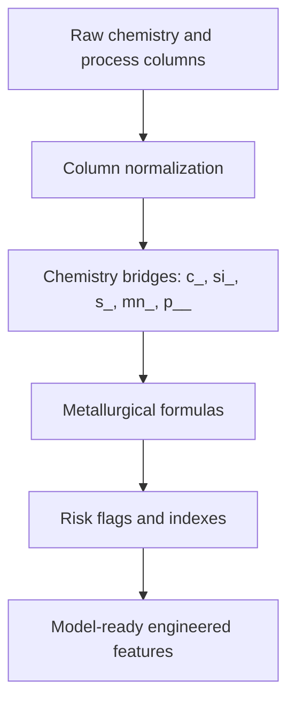

# Feature Engineering Documentation

## Purpose

Feature engineering converts raw foundry data into signals that better represent casting physics. Instead of relying only on raw columns, the platform creates features that describe metallurgical risk mechanisms.

Main source: `stage2_feature_engineering.py`.

## Feature Engineering Flow

## Feature Reference

| Feature | Formula / Logic | Industrial Meaning | High / Low Meaning | Quality Impact |
|---|---|---|---|---|
| `feat_ce_calculated` | `C + (Si + P) / 3` | Carbon Equivalent. Indicates solidification behavior. | Low CE can be hypoeutectic; high CE can be hypereutectic. | Affects shrinkage, graphite formation, hard spots, flotation. |
| `feat_ce_hypo_risk` | `1 if CE < 4.2 else 0` | Hypoeutectic risk flag. | High means CE is below eutectic target. | More micro-shrinkage and hard spots. |
| `feat_ce_hyper_risk` | `1 if CE > 4.3 else 0` | Hypereutectic risk flag. | High means excess carbon equivalent. | Graphite flotation and surface defects possible. |
| `feat_ce_optimal` | `1 if 4.2 <= CE <= 4.3 else 0` | Eutectic zone flag. | High means CE is in preferred zone. | More stable solidification. |
| `feat_c_si_ratio` | `C / Si` | Graphitization balance. | Very low or very high ratio is risky. | White iron risk, coarse graphite, strength variation. |
| `feat_c_si_risk` | `1 if ratio < 1.4 or > 2.0` | C/Si abnormality flag. | High means graphitization balance is poor. | Hard spots or weak graphite structure. |
| `feat_mn_s_ratio` | `Mn / S` | Sulfur neutralization indicator. | Low means Mn may not neutralize sulfur. | Poor nodularization and sulfur-related defects. |
| `feat_mn_s_risk` | `1 if Mn/S < 2.0` | Severe Mn/S risk flag. | High means dangerous sulfur balance. | Hot shortness and Mg treatment loss. |
| `feat_sulfur_risk` | `2 if S > 0.025; 1 if S > 0.015; else 0` | Sulfur severity. | Higher means more sulfur risk. | Mg depletion, poor nodularity, vermicular graphite. |
| `feat_mg_recovery_risk` | `1 if Mg recovery < 0.40` | Low magnesium recovery flag. | High means nodularization treatment may be ineffective. | Flake graphite, low nodularity, weak SG iron quality. |
| `feat_mg_recovery_severe` | `1 if Mg recovery < 0.30` | Severe Mg recovery failure. | High means critical treatment failure. | STOP-level metallurgical concern. |
| `feat_mg_recovery_dev` | `abs(Mg recovery - median Mg recovery)` | Batch-to-batch Mg recovery instability. | High means recovery is unusual relative to history. | Indicates unstable treatment process. |
| `feat_temp_loss` | `tapping_temp - pouring_temp` | Ladle and transfer temperature loss. | High means excessive heat loss. | Cold shuts, misruns, poor filling. |
| `feat_temp_loss_risk` | `1 if temp_loss > 80 C` | Critical heat loss flag. | High means transfer/ladle control problem. | Filling defects and thermal instability. |
| `feat_temp_loss_low` | `1 if temp_loss < 20 C` | Suspiciously low heat loss flag. | High may indicate measurement issue or very short transfer. | Data quality or process timing concern. |
| `feat_pouring_stability` | `-1 if pouring_temp < 1300; 1 if > 1500; else 0` | Pouring temperature range indicator. | Negative means cold pour; positive means overheated. | Cold shut, oxidation, gas, grain coarsening. |
| `feat_pouring_risk` | `1 if pouring_stability != 0` | Pouring temperature out-of-range flag. | High means temperature outside safe band. | Filling or oxidation defects. |
| `feat_oxidation_risk` | `Al > 0.02 plus 0.5 if pouring_temp > 1450` | Oxide inclusion tendency. | High means oxidation-promoting conditions. | Pinholes, inclusions, surface defects. |
| `feat_graphitization_index` | `2*Si + 5*CE - 3.5*Cr - 0.3*Mn - 3*Mo` where columns exist | Balance of graphitizers and carbide stabilizers. | Positive supports graphite; negative supports carbide. | White iron risk, hard zones, machinability issues. |
| `feat_white_iron_risk` | `1 if graphitization_index < 0` | Carbide/white iron risk flag. | High means graphitization is weak. | Hard spots and poor machinability. |
| `feat_shrinkage_risk_index` | `1.5*(CE < 4.2) + 1*(Si < 2.0) + 0.5*(pouring_temp > 1420)` | Composite shrinkage risk. | Higher means more shrinkage tendency. | Micro-shrinkage, internal porosity. |
| `feat_gas_risk_index` | `2*(N > 0.008) + 1*(Mg > 0.055) + 0.5*(CRCA > 50)` | Composite gas porosity risk. | Higher means gas/pinhole risk. | Nitrogen blowholes, Mg vapor pockets, pinholes. |
| `feat_chemistry_instability` | Sum of deviations outside ideal C, Si, Mn, Mg ranges | Overall chemistry deviation. | Higher means chemistry is farther from target. | General process instability and unpredictable casting quality. |
| `feat_chemistry_ok` | `1 if chemistry_instability < 0.1` | Chemistry within target flag. | High means stable chemistry. | Lower chemistry-driven defect risk. |
| `feat_fsm_s_index` | `FSM addition per MT / (S * 100)` | Sulfur-corrected FSM dose. | Low means possible undertreatment when sulfur is high. | Poor Mg treatment and nodularity risk. |
| `feat_fsm_undertreat_risk` | `1 if FSM < 8 and S > 0.012` | FSM undertreatment flag. | High means treatment may be insufficient. | Flake or vermicular graphite risk. |
| `feat_heel_ratio` | `heel / tapped_weight` | Heel metal share. | High means high carryover. | Impurity accumulation, sulfur/nitrogen variation. |
| `feat_heel_risk` | `1 if heel_ratio > 0.5` | Excessive heel carryover flag. | High means process carryover risk. | Chemistry drift and trace element accumulation. |

## Important Raw Columns Used

| Column | Meaning |
|---|---|
| `c_` | Carbon percent. |
| `si_` | Silicon percent. |
| `p__` | Phosphorus percent. |
| `s_` | Sulfur percent. |
| `mn_` | Manganese percent. |
| `mg_` | Magnesium percent where valid. |
| `mg_recovery_` | Magnesium recovery fraction or percent. |
| `tapping_temp` | Metal temperature when tapped from furnace. |
| `pouring_temp` | Metal temperature during pouring. |
| `crca` | Cold rolled closed annealed scrap/charge material indicator. |
| `fsmaddition_mt` | Ferro Silicon Magnesium addition per metric tonne. |
| `heel` | Residual metal left in furnace. |
| `tapped_wt_` | Tapped metal weight. |

## Why Engineered Features Matter

Raw data tells the model what happened. Engineered features tell the model why it matters. For example, `s_` and `mn_` individually are useful, but `feat_mn_s_ratio` directly expresses whether manganese can neutralize sulfur. That is more meaningful for foundry quality decisions.
