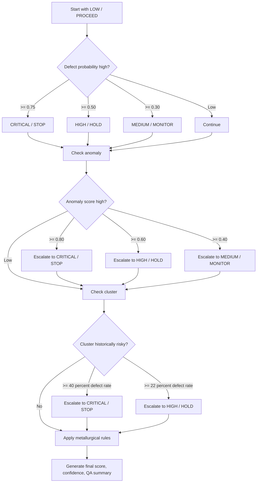

# Risk Scoring Documentation

## Purpose

Risk scoring converts model outputs and foundry rules into a final decision that engineers can act on.

Main source: `dashboard/risk_scoring.py`.

## Final Decision Outputs

| Output | Meaning |
|---|---|
| `risk_level` | Severity: LOW, MEDIUM, HIGH, CRITICAL. |
| `recommendation` | Action: PROCEED, MONITOR, HOLD, STOP. |
| `final_risk_score` | 0-100 score based on strongest risk signal. |
| `risk_confidence` | Confidence that the decision is supported by signals. |
| `risk_factors` | Short reasons behind the decision. |
| `qa_summary` | Human-readable industrial QA report. |

## Risk Engine Inputs

| Input | Source | Scale |
|---|---|---|
| `defect_prob` | Supervised classifier | 0-1 |
| `anomaly_score` | Isolation Forest | 0-1 |
| `cluster` | KMeans | Integer label |
| Cluster defect rate | Historical batches in same cluster | 0-1 |
| Metallurgical warnings | `interpretation_rules.py` | Rule severity |

## Threshold Logic

### Defect Probability

| Threshold | Risk Level | Recommendation |
|---|---|---|
| `>= 0.75` | CRITICAL | STOP |
| `>= 0.50` | HIGH | HOLD |
| `>= 0.30` | MEDIUM | MONITOR |

### Anomaly Score

| Threshold | Risk Level | Recommendation |
|---|---|---|
| `>= 0.80` | CRITICAL | STOP |
| `>= 0.60` | HIGH | HOLD |
| `>= 0.40` | MEDIUM | MONITOR |

### Cluster History

| Threshold | Risk Meaning | Recommendation |
|---|---|---|
| Cluster defect rate `>= 0.40` | Historically dangerous process group | STOP |
| Cluster defect rate `>= 0.22` | Elevated historical risk | HOLD |

## Recommendation Meaning

| Recommendation | Plain English | Engineering Meaning |
|---|---|---|
| PROCEED | Batch looks acceptable. | No strong ML, anomaly, cluster, or rule risk. |
| MONITOR | Watch carefully. | Some elevated signal, but not severe enough to hold. |
| HOLD | Do not release without review. | High probability, anomaly, cluster, or metallurgical warning. |
| STOP | Stop/reject/major intervention. | Critical risk signal or severe rule violation. |

## Risk Level Meaning

| Risk Level | Meaning |
|---|---|
| LOW | No major risk signal. |
| MEDIUM | Elevated condition that should be watched. |
| HIGH | Strong concern requiring engineering review. |
| CRITICAL | Severe risk requiring immediate action. |

## Escalation Logic

The system always keeps the more severe result when signals disagree. For example:

| Scenario | Final Behavior |
|---|---|
| Low defect probability but critical anomaly | Escalates to CRITICAL/STOP. |
| Medium ML probability and high cluster defect rate | Escalates to HIGH/HOLD. |
| Rule engine detects critical Mg recovery | Escalates to CRITICAL/STOP. |
| All signals low | Remains LOW/PROCEED. |

## Final Risk Score

The current formula is:

```text
final_risk_score = 100 * max(defect_prob, anomaly_score, cluster_defect_rate)
```

It is rounded to one decimal place. This means the score represents the strongest available quantitative risk signal.

## Confidence Logic

```text
risk_confidence = min(0.95, 0.45 + 0.18 * n_high + 0.12 * number_of_risk_factors)
```

Where `n_high` counts whether these signals are elevated:

| Signal | Elevated When |
|---|---|
| Defect probability | `>= 0.30` |
| Anomaly score | `>= 0.40` |
| Cluster risk | Cluster defect rate is at least half the hold threshold |

## HOLD vs STOP

| Decision | When Used |
|---|---|
| HOLD | Risk is high, but may be recoverable after inspection, recheck, retesting, or engineering approval. |
| STOP | Risk is critical and should not proceed without major intervention. |

## Decision Flow



## Safeguards

| Safeguard | Purpose |
|---|---|
| Unit interval sanitization | Converts accidental 0-100 percent values into 0-1 scale or clips invalid scores. |
| `ensure_unified_decisions` | Refreshes stale cached decisions before display or export. |
| Recommendation normalization | Converts legacy reject wording into STOP vocabulary. |
| QA summary synchronization | Ensures report text matches final fields. |
