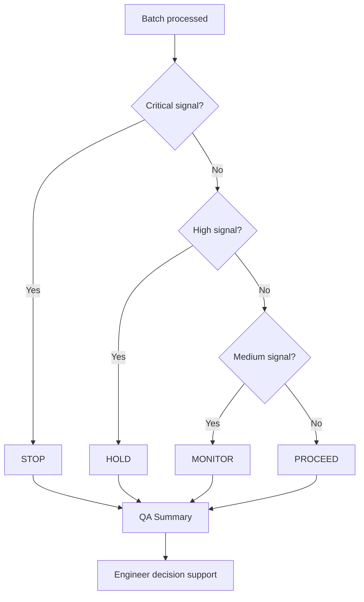

# Business Logic

## Why Batches Are Flagged

A batch is flagged when one or more risk signals suggest it may create a defective casting or unstable process condition.

| Signal | Business Reason |
|---|---|
| High defect probability | Historical data says similar batches often fail. |
| High anomaly score | Batch looks unusual compared with known production behavior. |
| Risky cluster | Similar process group has high historical defect rate. |
| Metallurgical rule warning | Known foundry physics indicates danger. |

## Why Some Batches Are STOP

STOP means the risk is critical. The system uses STOP when the batch should not continue without major engineering action.

Examples:

| Trigger | Why STOP Is Reasonable |
|---|---|
| `defect_prob >= 0.75` | The classifier strongly predicts defect. |
| `anomaly_score >= 0.80` | Process pattern is radically unusual. |
| Cluster defect rate `>= 0.40` | Similar historical process group is dangerous. |
| Critical sulfur or Mg recovery rules | Metallurgical failure mode is severe. |

## Why Some Batches Are HOLD

HOLD means the batch should not be released automatically. It may be recoverable after engineering review, lab check, microscopy, re-treatment, or supervisor approval.

Examples:

| Trigger | HOLD Logic |
|---|---|
| `defect_prob >= 0.50` | High model risk but below critical threshold. |
| `anomaly_score >= 0.60` | Unusual process behavior needs investigation. |
| Cluster defect rate `>= 0.22` | Similar batches have elevated risk. |
| CE, sulfur, temperature, or Mg warnings | Known process issue needs review. |

## Why MONITOR Exists

MONITOR is used for medium risk. It avoids overreacting to mild signals while still notifying engineers.

Examples:

| Trigger | Meaning |
|---|---|
| `defect_prob >= 0.30` | Elevated ML probability. |
| `anomaly_score >= 0.40` | Mildly unusual process pattern. |
| Warning-level temperature loss | Watch but may not require hold. |

## Why Confidence Matters

Confidence tells the user how strongly the final decision is supported by multiple signals.

| Confidence Situation | Interpretation |
|---|---|
| High confidence | Multiple signals agree or several risk factors are active. |
| Medium confidence | Some risk evidence exists. |
| Low confidence | Decision is less strongly supported; review context manually. |

## Why False Negatives Are Dangerous

A false negative means the system treats a defective batch as healthy. In foundry operations, this is dangerous because the casting may proceed to machining, assembly, dispatch, or customer inspection before the defect is found.

Business impact:

| Impact | Explanation |
|---|---|
| Rework cost | Defects found late cost more to fix. |
| Scrap cost | Metal, energy, labor, and time are wasted. |
| Customer risk | Escaped defects damage trust. |
| Delivery risk | Replacement castings delay production. |

## Why False Positives Still Matter

A false positive is a healthy casting flagged as risky. It is less dangerous than a false negative, but too many false positives create inspection burden and production delays.

The dashboard balances this using precision, recall, F1, and decision thresholds.

## Why Anomaly Detection Matters

Supervised models learn from known historical labels. But foundries can experience new process issues that were not common in training data. Anomaly detection helps catch unusual process patterns even when the classifier is uncertain.

Examples:

| Situation | Why Anomaly Detection Helps |
|---|---|
| New charge material behavior | Pattern may not match previous defects. |
| Sensor or entry error | Values may be physically unusual. |
| Furnace/ladle process drift | Batch may move outside known process envelope. |
| Rare combination of parameters | Classifier may lack enough examples. |

## Business Decision Matrix

| Risk Level | Recommendation | Business Action |
|---|---|---|
| LOW | PROCEED | Continue normal flow. |
| MEDIUM | MONITOR | Continue with awareness and added observation. |
| HIGH | HOLD | Stop release until engineering review. |
| CRITICAL | STOP | Stop/reject/major intervention before continuing. |

## Business Logic Diagram

