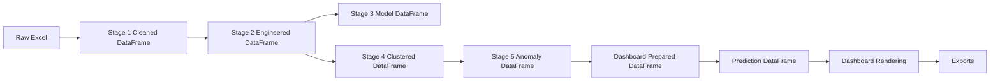
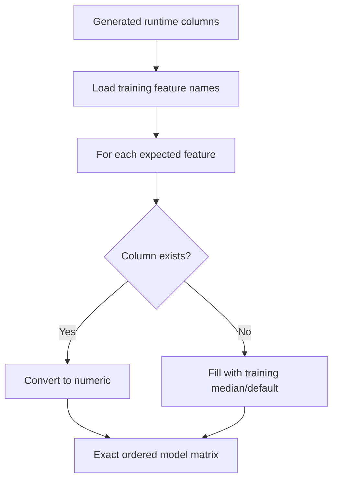

# Data Flow

## End-to-End Data Flow

## Offline Training Data Flow

| Step | Input | Output | File |
|---|---|---|---|
| Raw data | `melting_cleaned_final.xlsx` | Raw DataFrame | Excel |
| Stage 1 cleaning | Raw DataFrame | Cleaned ML data | `outputs/melting_cleaned_stage1.csv` |
| Traceability extraction | Raw DataFrame | IDs/codes | `outputs/traceability_columns.csv` |
| Stage 2 features | Cleaned data | Engineered features | `outputs/melting_features_stage2.csv` |
| Stage 3 classifier | Engineered data | Models and metrics | `models/best_classifier.pkl`, `outputs/model_comparison.csv` |
| Stage 4 PCA/clustering | Engineered data | Clustered data | `outputs/melting_clustered_stage4.csv` |
| Stage 5 anomalies | Clustered data | Anomaly-enriched data | `outputs/melting_with_anomalies_stage5.csv` |

## Runtime Upload Data Flow

| Step | Function | Result |
|---|---|---|
| Parse file | `_load_raw_file` | Raw upload DataFrame. |
| Normalize headers | `normalize_dataframe` | Clean column names. |
| Apply aliases | `apply_upload_aliases` | Canonical process names. |
| Validate template | `template_column_validation` | Missing/extra/matched template fields. |
| Coerce numeric | `_coerce_numeric_columns` | Numeric process columns. |
| Fill missing | `_fill_numeric_nan` | Median-imputed values. |
| Feature engineering | `run_stage2_feature_engineering`, `_engineer_features` | Engineered features. |
| Defect probability | `_ensure_defect_prob` | `defect_prob`, `defect_pred`. |
| PCA/cluster | `_ensure_pca_and_cluster` | `pca_pc1`, `pca_pc2`, `cluster`. |
| Anomaly | `_ensure_anomaly` | `anomaly_score`, `anomaly_flag`, `anomaly_severity`. |
| Unified decision | `enrich_dataframe` | Risk columns and QA summary. |

## DataFrame Evolution

### Raw Excel DataFrame

Contains original plant columns such as heat, chemistry, temperature, additions, and defect labels. Names may be inconsistent.

### Cleaned DataFrame

After Stage 1:

| Change | Reason |
|---|---|
| Column names normalized | Consistent processing. |
| Duplicates removed | Avoid repeated records. |
| Target renamed to `defect` | Standard ML target. |
| Traceability columns separated | Prevent non-ML identifiers from entering model. |
| Leakage columns removed | Prevent fake perfect predictions. |
| Missing values imputed | Model readiness. |
| Extreme outliers clipped | Stabilize training. |

### Engineered DataFrame

After Stage 2, columns starting with `feat_` are added.

### Model DataFrame

Used by Stage 3. It contains numeric non-leakage columns and the target `defect`.

### Clustered DataFrame

After Stage 4:

| Column | Meaning |
|---|---|
| `cluster` | KMeans process group. |
| `dbscan_cluster` | DBSCAN comparison label. |
| `pca_pc1` | First PCA coordinate. |
| `pca_pc2` | Second PCA coordinate. |

### Prediction DataFrame

At dashboard runtime:

| Column | Meaning |
|---|---|
| `defect_prob` | Probability of defect. |
| `defect_pred` | Predicted defect class. |
| `anomaly_score` | Unusualness score. |
| `anomaly_flag` | Binary anomaly flag. |
| `anomaly_severity` | NORMAL to CRITICAL label. |
| `risk_level` | LOW to CRITICAL final level. |
| `recommendation` | PROCEED/MONITOR/HOLD/STOP. |
| `final_risk_score` | 0-100 final score. |
| `risk_confidence` | Decision confidence. |
| `qa_summary` | Explanation report. |

## Schema Alignment

Model inference requires exact feature names and order. `align_features_to_training_schema` creates an aligned DataFrame:

## Preferred Default Dataset

When the dashboard loads without upload, it checks:

1. `outputs/melting_with_anomalies_stage5.csv`
2. `outputs/melting_clustered_stage4.csv`
3. `outputs/melting_features_stage2.csv`

The best available file is loaded and passed through `prepare_dashboard_dataframe`.
