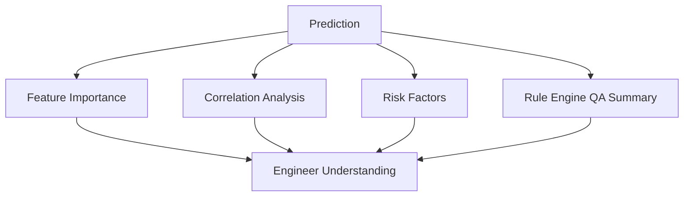

# Model Explainability

## Goal

Explainability answers: why did the model or risk engine flag this batch?

Casting AI uses three levels of explainability:

1. Model feature importance.
2. Data relationships and correlations.
3. Metallurgical rule-based QA explanations.

## Explainability Architecture

## Model Feature Importance

The platform loads feature importance from the saved classifier when available:

| Model Type | Importance Method |
|---|---|
| Tree ensembles | `feature_importances_` |
| Logistic Regression | Absolute coefficient values |
| Fallback | Correlation with `defect` or `defect_prob` |

Main function:

| Function | File |
|---|---|
| `get_feature_importance` | `dashboard/pipeline.py` |
| `correlation_feature_importance` | `dashboard/pipeline.py` |

## Correlation-Based Explanation

The dashboard shows parameter correlation heatmaps. These help engineers understand relationships between process variables, such as:

| Relationship | Possible Meaning |
|---|---|
| Temperature loss vs defect probability | Transfer temperature control may affect defects. |
| Sulfur vs Mg recovery | Sulfur may consume magnesium. |
| Chemistry instability vs risk level | Out-of-range chemistry drives decisions. |
| Shrinkage risk vs defect | Solidification risk may be defect driver. |

## Defect-Driving Parameters

The Main Analytics page compares healthy and defective behavior. If actual `defect` labels exist, it looks at mean differences between classes. If labels are not available, it uses correlation with `defect_prob`.

Simple explanation: it asks, "Which parameters look most different between healthy and defective castings?"

## Rule-Based Explainability

`interpretation_rules.py` explains specific industrial warnings:

| Rule | Explains |
|---|---|
| `rule_sulfur` | High sulfur and poor Mn/S ratio. |
| `rule_carbon_equivalent` | Hypoeutectic or hypereutectic CE. |
| `rule_mg_recovery` | Low Mg recovery and nodularity risk. |
| `rule_temperature` | Excessive temperature loss, cold pour, overheating. |
| `rule_shrinkage` | High shrinkage risk index. |
| `rule_gas_porosity` | High gas porosity risk index. |
| `rule_ai_prediction` | ML probability warning. |
| `rule_anomaly` | Unusual process pattern warning. |

## Risk Factors

`dashboard/risk_scoring.py` creates compact risk factors such as:

| Risk Factor Example | Meaning |
|---|---|
| `Defect probability 78.0% (critical)` | Classifier strongly predicts defect. |
| `Anomaly score 0.82 (critical pattern)` | Batch is very unusual. |
| `Cluster 2 historical defect rate 45.0%` | Similar historical process group was risky. |

## QA Summary

The QA summary is a readable industrial report. It includes:

| Section | Meaning |
|---|---|
| Header | Final risk level. |
| Defect/anomaly/cluster line | Main numeric signals. |
| Warnings | Rule-triggered issues. |
| Probable causes | Why the issue may happen in foundry terms. |
| Engineering recommendations | Suggested next actions. |
| Final recommendation | PROCEED/MONITOR/HOLD/STOP. |

## Explainability Strategy

| User | Best Explainability View |
|---|---|
| Senior | Fleet KPIs, risk distribution, recommendations, export reports. |
| Melting engineer | QA summary, key process parameters, risk factors, cluster insights. |
| Data scientist/interviewer | Feature importance, ROC, PR curve, confusion matrix, model pipeline. |
| Judge/reviewer | End-to-end explainability: feature engineering + ML + rule engine. |

## Limitations

| Limitation | Explanation |
|---|---|
| Feature importance is global | It explains overall model behavior, not exact row-level SHAP values. |
| Correlation is not causation | Heatmaps show relationships, not guaranteed causes. |
| Rule thresholds are configurable | Foundry-specific control plans may require tuning. |

## Future Explainability Improvements

| Improvement | Benefit |
|---|---|
| SHAP values | Row-level feature contributions. |
| Calibration plots | Validate probability reliability. |
| Counterfactual suggestions | Show what parameter change would reduce risk. |
| Process control limits | Compare to plant-specific spec limits. |
| Root cause ranking | Combine rules and model explanations into ranked causes. |
