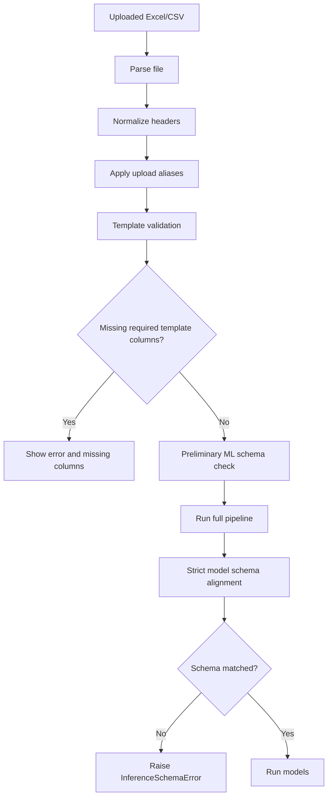

# Upload Validation System

## Purpose

Upload validation ensures that the file submitted by a user can be safely processed by the trained ML pipeline.

Main files:

| File | Purpose |
|---|---|
| `dashboard/pipeline.py` | Template validation and runtime pipeline. |
| `dashboard/preprocessing.py` | Header normalization, aliases, schema alignment. |
| `dashboard/config/features.py` | Expected feature schemas and sample rows. |

## Validation Flow



## Template Validation

The master template is:

```text
melting_cleaned_template.xlsx
```

The platform compares uploaded columns against the template using normalized names and semantic groups.

Example semantic groups:

| Canonical Field | Accepted Variants |
|---|---|
| `pouring_wt` | `pouring_wt`, `pouring_weight` |
| `furnace_on_time` | `furnace_on_time`, `furnace_on`, `furnace_on_time_min` |
| `tapping_temp` | `tapping_temp`, `tapping_temperature`, `tap_temp` |
| `pouring_temp` | `pouring_temp`, `pouring_temperature`, `pour_temp` |
| `mg_recovery` | `mg_recovery`, `mg_recovery_pct`, `magnesium_recovery` |
| `defect` | `defect`, `defected`, `defective`, `is_defect`, `quality_defect` |

## Schema Checks

The schema validation report tracks:

| Field | Meaning |
|---|---|
| `uploaded_columns` | Number of columns in upload. |
| `expected_columns` | Number of expected model features. |
| `matched_columns` | Features found in upload/generated data. |
| `missing_columns` | Features not found before alignment. |
| `extra_columns` | Upload columns not used by model. |
| `auto_filled_columns` | Missing features filled from training medians/defaults. |
| `duplicate_columns_removed` | Duplicate columns removed. |
| `dtype_mismatches` | Non-numeric fields where numeric was expected. |
| `nan_columns` | Columns requiring NaN handling. |
| `infinite_columns` | Columns containing infinite values. |
| `schema_status` | `MATCHED` or `MISMATCHED`. |

## Missing Columns

Missing template columns stop the upload because the file may not represent the required casting process template.

Missing ML features after feature engineering can be auto-filled only when strict alignment permits it. The platform uses saved training medians/defaults where possible.

## Auto-Filled Features

Auto-fill exists to prevent inference crashes when a non-critical model feature is missing after upload processing.

Important: auto-fill does not mean the input file was perfect. It means the pipeline could still create a valid model matrix by using training defaults.

## Inference Alignment

The model requires exact feature order. `align_features_to_training_schema` creates a matrix with:

1. Exactly the saved feature names.
2. Exactly the saved feature order.
3. Numeric values only.
4. Missing values filled.
5. Extra columns dropped.

This protects against common production ML bugs where columns are reordered or silently mismatched.

## Common Validation Errors

| Error | Likely Cause | Fix |
|---|---|---|
| Uploaded file format does not match template | Required template column missing. | Use sample template and keep required headers. |
| Inference schema mismatch | Generated features do not match saved model schema. | Re-run pipeline or ensure feature schema files exist. |
| PCA feature mismatch | PCA input feature count differs from training. | Check `models/pca_feature_names.json`. |
| IsolationForest feature mismatch | Anomaly input feature count differs from training. | Check `models/isolation_forest_feature_names.json`. |
| Model file missing | Training stage not run. | Run stages 1-5. |

## Validation UI

The upload page shows:

| UI Output | Meaning |
|---|---|
| Uploaded columns | Count of file columns. |
| Expected ML features | Count of trained features. |
| Matched | Number of matched fields. |
| Missing required columns | Template mismatch requiring correction. |
| Extra columns | Allowed but ignored if not useful. |
| Auto-filled warning | Some ML fields are filled from training medians. |

## Best Practice for Users

1. Download the sample template.
2. Keep column headers unchanged where possible.
3. Fill process and chemistry values consistently.
4. Avoid using percent symbols inconsistently.
5. Upload CSV or Excel.
6. Review validation messages before trusting predictions.
