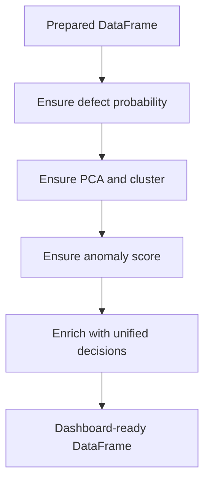

# Prediction Logic

## Purpose

Prediction logic explains how the dashboard converts an uploaded file into defect probability, anomaly score, cluster label, confidence, and final risk intelligence.

Main file: `dashboard/pipeline.py`.

## Prediction Flow

## Defect Probability Generation

Function: `_ensure_defect_prob`.

Logic:

1. If `defect_prob` already exists and contains valid values, normalize it to 0-1.
2. Otherwise load `models/best_classifier.pkl`.
3. Load expected feature names.
4. Align input features to training schema.
5. Run `predict_proba(X)[:, 1]`.
6. Normalize probability to 0-1.
7. Store `defect_prob`.
8. Store `defect_pred`.

## Probability Normalization

The platform protects against values accidentally stored as percentages.

| Input Scale | Handling |
|---|---|
| 0-1 | Used directly. |
| Mostly 0-100 | Divided by 100. |
| Few values above 1 | Clipped to 0-1. |
| Extreme invalid scale | Min-max scaled or sanitized. |

## PCA and Cluster Generation

Function: `_ensure_pca_and_cluster`.

Logic:

1. If `pca_pc1`, `pca_pc2`, and `cluster` already exist, reuse them after numeric cleanup.
2. Otherwise load:
   - `models/pca_model.pkl`
   - `models/kmeans_model.pkl`
   - `models/pca_scaler.pkl`
   - `models/pca_feature_names.json`
3. Align features to PCA training schema.
4. Scale features.
5. Transform with PCA.
6. Predict cluster using KMeans.

## Anomaly Score Generation

Function: `_ensure_anomaly`.

Logic:

1. If `anomaly_score` already exists and is valid, normalize it.
2. Otherwise load:
   - `models/isolation_forest.pkl`
   - `models/anomaly_scaler.pkl`
   - `models/isolation_forest_feature_names.json`
3. Align features to Isolation Forest schema.
4. Scale features.
5. Compute `score_samples`.
6. Normalize so higher means more anomalous.
7. Set `anomaly_flag`.
8. Convert score to `anomaly_severity`.

## Anomaly Severity Mapping

| Score | Severity |
|---|---|
| `>= 0.80` | CRITICAL |
| `>= 0.60` | HIGH RISK |
| `>= 0.40` | MEDIUM RISK |
| `>= 0.20` | LOW RISK |
| `< 0.20` | NORMAL |

## Final Risk Intelligence

Function: `enrich_dataframe`.

Each row is passed to `unified_risk_assessment`, which combines:

| Signal | Use |
|---|---|
| `defect_prob` | Main supervised defect risk. |
| `anomaly_score` | Unusual process behavior. |
| `cluster` | Historical process group. |
| Cluster defect rate | Risk from similar historical batches. |
| Rule engine | Foundry-specific warnings and recommendations. |

## Final Decision Outputs

| Column | Generation Logic |
|---|---|
| `risk_level` | Highest severity from ML, anomaly, cluster, and rules. |
| `recommendation` | Most severe recommendation from all signals. |
| `final_risk_score` | `100 * max(defect_prob, anomaly_score, cluster_rate)`. |
| `risk_confidence` | Signal agreement and number of risk factors. |
| `risk_factors` | Defect/anomaly/cluster triggers. |
| `qa_summary` | Final synchronized QA report. |

## Example Decision Cases

| Defect Prob | Anomaly | Cluster Rate | Likely Decision |
|---|---|---|---|
| 0.10 | 0.15 | 0.05 | LOW / PROCEED |
| 0.35 | 0.10 | 0.05 | MEDIUM / MONITOR |
| 0.55 | 0.20 | 0.10 | HIGH / HOLD |
| 0.20 | 0.85 | 0.10 | CRITICAL / STOP |
| 0.25 | 0.20 | 0.45 | CRITICAL / STOP |
| 0.80 | 0.10 | 0.05 | CRITICAL / STOP |

## Why Anomaly Affects Results

Anomaly score can escalate risk even when defect probability is low. This is intentional because:

1. The classifier learns known historical defect patterns.
2. Anomaly detection catches unusual process behavior.
3. Unusual does not always mean defective, but it requires attention.

## Why Cluster History Affects Results

If a batch belongs to a process cluster with high historical defect rate, the system treats that as contextual evidence. This helps when a single row looks borderline but belongs to a historically risky process family.
