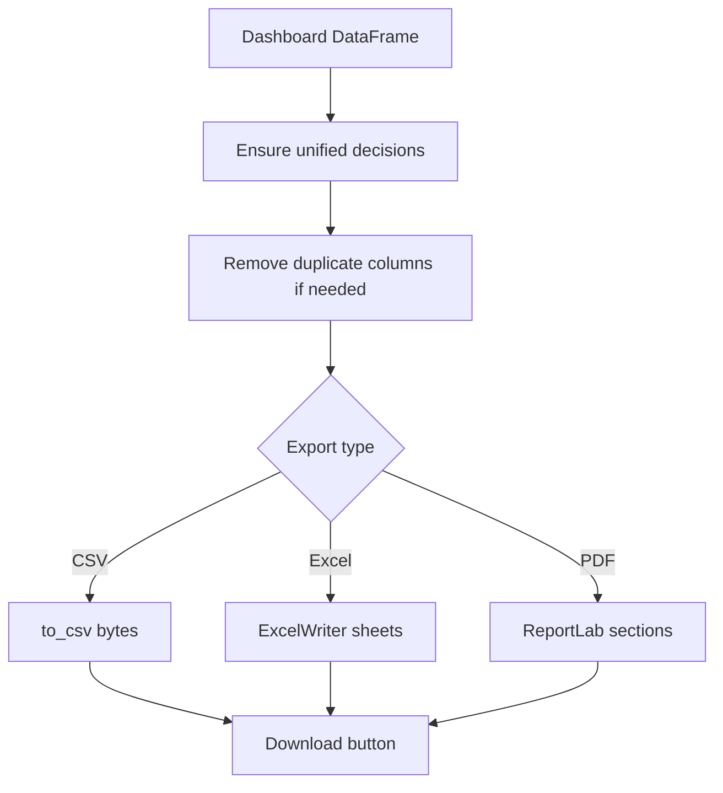

# Export System

## Purpose

The export system converts dashboard results into shareable files for seniors, engineers, quality teams, reviewers, and portfolio presentation.

Main files:

| File | Purpose |
|---|---|
| `dashboard/exports.py` | Standard page-level CSV, Excel, and PDF exports. |
| `dashboard/unified_export.py` | Full Main Analytics report exports. |

## Export Types

| Export | Format | Use Case |
|---|---|---|
| CSV | `.csv` | Raw processed results for analysis. |
| Excel | `.xlsx` | Multi-sheet technical handover/report. |
| PDF | `.pdf` | Senior-friendly and review-friendly report. |

## CSV Export

CSV exports write the processed DataFrame after ensuring final risk decisions are fresh.

Key function:

```text
dataframe_csv_bytes(df)
```

What it includes:

| Content | Description |
|---|---|
| Processed rows | All selected columns in tabular form. |
| Risk fields | Risk level, recommendation, final score, confidence. |
| ML fields | Defect probability, anomaly score, cluster where available. |
| QA fields | QA summary and risk factors where selected. |

## Excel Export

Excel exports use `openpyxl`.

Standard page export:

```text
dataframe_excel_bytes(df, sheet_name)
```

Unified full report export:

```text
export_excel_bytes(df, selected_idx)
```

Unified Excel sheets:

| Sheet | Purpose |
|---|---|
| Processed Results | Full processed dataset. |
| Fleet Summary | Total batches, average defect probability, critical count, recommendation counts. |
| Risk & Anomaly | Key risk, anomaly, cluster, and QA fields. |
| Selected Batch | Transposed selected batch details. |
| Top Anomalies | Highest anomaly score batches. |

## PDF Export

PDF export uses ReportLab if installed.

Key functions:

| Function | Purpose |
|---|---|
| `build_pdf_report` | Generic PDF builder from sections. |
| `overview_executive_pdf` | Fleet-level executive summary. |
| `single_batch_qa_pdf` | QA report for selected batch. |
| `anomaly_audit_pdf` | Top anomaly audit report. |
| `export_pdf_bytes` | Full Main Analytics report. |

## PDF Report Structure

PDF reports may include:

| Section | Content |
|---|---|
| Title | Report name and generation timestamp. |
| Fleet summary | Total batches, average defect probability, critical batches, recommendation counts. |
| Processed sample | Selected columns from processed results. |
| Top anomalies | Highest anomaly score rows. |
| Selected batch | QA summary and risk factors for selected row. |

## Export Safety

Before export, the system calls:

```text
ensure_unified_decisions(df)
```

This prevents stale cached decision fields from being exported. It also normalizes recommendation vocabulary.

## Export Flow



## When to Use Each Export

| Audience | Recommended Export |
|---|---|
| Senior management | PDF summary. |
| Melting engineers | Excel with risk/anomaly and selected batch sheets. |
| Data/ML reviewer | CSV or Excel with processed results. |
| Interviewer | PDF plus screenshots/dashboard demo. |
| Future developer | Excel and CSV for test cases. |

## Common Export Issues

| Issue | Cause | Fix |
|---|---|---|
| PDF unavailable | `reportlab` not installed. | Install `reportlab` from requirements or pip. |
| Duplicate column problem | Upload has repeated headers. | Export helper removes duplicate columns. |
| Stale recommendation | Cached Streamlit data. | `ensure_unified_decisions` refreshes it. |
