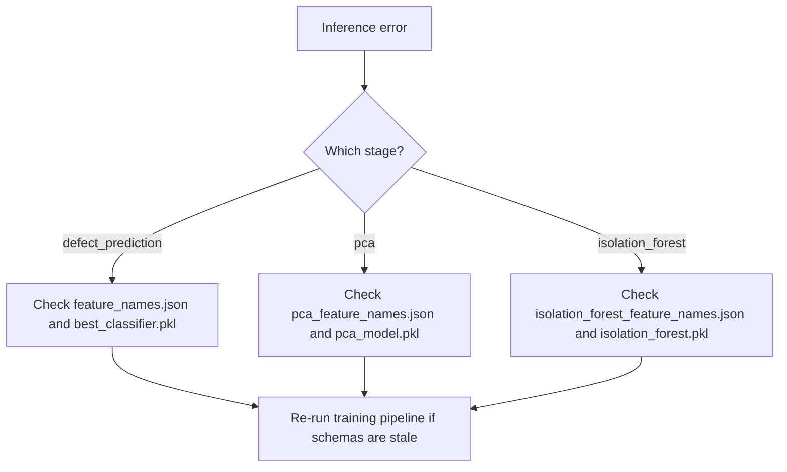

# Debugging and Logs

## Purpose

This guide explains how to debug data, model, upload, and dashboard issues.

## Important Log Files

| File | Purpose |
|---|---|
| `debug-f72dd6.log` | Existing debug log from previous runs. |
| `streamlit-8505.out.log` | Streamlit standard output log. |
| `streamlit-8505.err.log` | Streamlit error log. |
| `outputs/cleaning_report.txt` | Stage 1 cleaning report. |
| `outputs/validation_report.txt` | Validation and KPI report. |

## Pipeline Logs

The training scripts use Python logging and print stage progress:

| Script | Useful Logs |
|---|---|
| `stage1_data_cleaning.py` | Loaded shape, column mapping, leakage columns, missing values, outlier clipping. |
| `stage2_feature_engineering.py` | Applied feature functions and new feature list. |
| `stage3_supervised_model.py` | Model metrics, classification reports, selected best model. |
| `stage4_pca_clustering.py` | PCA variance, optimal cluster count, cluster profiles. |
| `stage5_anomaly_detection.py` | Anomaly counts and severity summary. |

## Common Issues and Fixes

| Problem | Likely Cause | Fix |
|---|---|---|
| Dashboard shows no data | Outputs not generated. | Run stages 1-5. |
| `Model file not found` | Stage 3 not run. | Run `python stage3_supervised_model.py`. |
| Upload template error | Missing required template columns. | Use sample template. |
| Feature schema mismatch | Runtime features do not match saved schema. | Check feature JSON files and rerun training stages. |
| PCA feature mismatch | PCA expected different number/order of columns. | Regenerate PCA model and feature schema. |
| IsolationForest feature mismatch | Anomaly model schema mismatch. | Regenerate Stage 5 artifacts. |
| All batches STOP | Probabilities may be 0-100 instead of 0-1, or data is truly high risk. | Check normalization logs and input columns. |
| Perfect AUC | Data leakage. | Check leakage columns and remove target-coded fields. |
| Poor recall | Distribution shift or insufficient defect examples. | Retrain with more representative labeled data. |

## Feature Mismatch Debugging

When schema mismatch occurs, inspect:

| Artifact | Meaning |
|---|---|
| `models/feature_names.json` | Classifier feature schema. |
| `models/pca_feature_names.json` | PCA feature schema. |
| `models/isolation_forest_feature_names.json` | Anomaly feature schema. |
| `models/feature_training_stats.pkl` | Fill values for missing features. |

## Upload Debugging

The upload UI shows a temporary validation debug expander with:

| Item | Meaning |
|---|---|
| Normalized template columns | Expected template headers after normalization. |
| Normalized uploaded columns | Uploaded headers after normalization. |
| Matched columns | Template fields found. |
| True missing columns | Required fields absent from upload. |
| Extra columns | Allowed fields not in template. |

## PCA Mismatch

PCA models are sensitive to feature order and count. If PCA mismatch happens:

1. Confirm `models/pca_feature_names.json` exists.
2. Confirm uploaded/generated features align with that schema.
3. Re-run Stage 4 after any feature engineering change.
4. Re-run Stage 5 because anomaly features may depend on Stage 4 output.

## Inference Schema

The inference schema must match the training schema exactly. The system aligns columns automatically, but severe mismatch indicates the model artifacts and feature generation code are out of sync.

Debug flow:



## Decision Debugging

Set environment variable:

```text
CASTING_AI_DEBUG_DECISIONS=1
```

This enables additional logging in `dashboard/risk_scoring.py` for early rows, showing raw and sanitized decision inputs.

## Recommended Debug Order

1. Check Streamlit error log.
2. Check upload validation debug.
3. Check whether required model artifacts exist.
4. Check feature schema JSON files.
5. Run stages 1-5 in order.
6. Reload dashboard.
7. Export a small CSV and inspect final fields.
