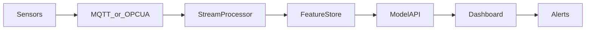
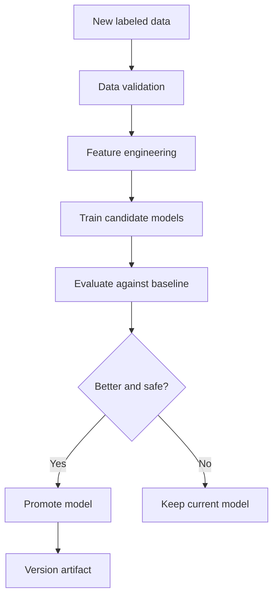

# Future Improvements

## Real-Time IoT Integration

Connect furnace, ladle, temperature probe, spectrometer, and pouring station data directly to the platform.

Benefits:

| Benefit | Explanation |
|---|---|
| Less manual upload | Data flows automatically. |
| Faster intervention | Engineers see risk before pouring or release. |
| Better traceability | Sensor time-series connects to each heat. |

## SAP / ERP Integration

Integrate with SAP or ERP systems for production orders, material batches, inspection results, and customer dispatch data.

Possible data:

| ERP Data | Use |
|---|---|
| Work order | Link predictions to production plan. |
| Material batch | Trace defect risk to charge source. |
| Inspection result | Feed new labels for retraining. |
| Customer claim | Long-term quality feedback. |

## Live Sensor Feed

Streaming temperature, chemistry, power, furnace state, and ladle timing can improve prediction timing.

Architecture idea:

## Predictive Maintenance

Use process drift, temperature loss, and anomaly trends to detect equipment problems such as ladle insulation degradation, furnace power instability, or probe calibration issues.

## Reinforcement Learning

Future research could recommend process corrections such as temperature adjustment, inoculant dosage, or treatment timing. This should only be attempted with strict engineering approval and safety constraints.

## Computer Vision for Defects

Add image-based defect detection using casting surface images, X-ray images, or microstructure images.

Possible models:

| Image Type | ML Task |
|---|---|
| Surface images | Crack, blowhole, cold shut detection. |
| X-ray images | Internal porosity detection. |
| Microstructure images | Nodularity and nodule count estimation. |

## Cloud Deployment

Deploy the dashboard and model inference as a secure internal web application.

Options:

| Deployment | Notes |
|---|---|
| Streamlit Community/Cloud | Simple demo deployment. |
| Docker + VM | Internal industrial deployment. |
| Kubernetes | Scalable enterprise deployment. |
| Azure/AWS/GCP | Managed infrastructure and identity integration. |

## Model Retraining Pipeline

Automate model retraining when new labeled data arrives.

## Role-Based Access

Add user roles:

| Role | Access |
|---|---|
| Viewer | Read dashboard and exports. |
| Engineer | Upload files and review risk. |
| QA Lead | Approve HOLD/STOP decisions. |
| Admin | Manage thresholds, users, and retraining. |

## Threshold Management UI

Move threshold values from code into a controlled configuration page so foundry engineers can tune:

| Threshold | Example |
|---|---|
| Sulfur warning/critical | `0.015`, `0.025` |
| CE hypo/hyper | `4.20`, `4.30` |
| Defect probability STOP | `0.75` |
| Anomaly STOP | `0.80` |

## Better Explainability

| Improvement | Benefit |
|---|---|
| SHAP | Row-level feature impact. |
| Calibration plots | Trustworthy probability interpretation. |
| Counterfactuals | Shows what changes reduce risk. |
| Rule trace | Exact rules triggered for every decision. |

## Data Quality Monitoring

Add dashboards for missing values, sensor drift, impossible values, duplicate rows, and template compliance over time.

## Alerting

Add email, Teams, WhatsApp, or SMS alerts for CRITICAL/STOP batches.

## Audit Trail

Store every prediction with:

| Field | Purpose |
|---|---|
| Uploaded file hash | Reproducibility. |
| Model version | Trace which model made decision. |
| Threshold version | Trace decision logic. |
| User | Accountability. |
| Timestamp | Audit history. |
| Final action | Business outcome. |

## Database Backend

Move from CSV artifacts to a database such as PostgreSQL for production reliability.

## API Layer

Expose predictions through an API so other systems can call the model without using Streamlit directly.

## Production Hardening

| Area | Improvement |
|---|---|
| Testing | Unit tests for feature engineering and risk scoring. |
| CI/CD | Automated checks before deployment. |
| Model registry | Versioned artifacts. |
| Monitoring | Drift, latency, error rates. |
| Security | Authentication, authorization, file scanning. |
