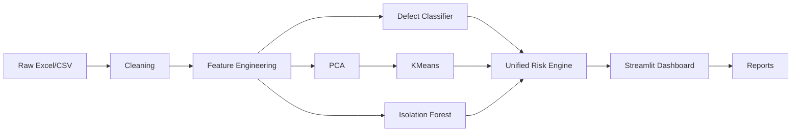

# Interview Explanation

## 60-Second Project Explanation

Casting AI is an end-to-end industrial machine learning platform for foundry casting quality. It takes melting process data from Excel or CSV, validates the template, cleans and normalizes the data, engineers metallurgy-based features, predicts defect probability using supervised ML, detects unusual batches using anomaly detection, clusters similar process behavior using PCA and KMeans, and generates explainable risk decisions like PROCEED, MONITOR, HOLD, or STOP. The dashboard is built in Streamlit and includes fleet analytics, single-batch QA reports, ML performance metrics, feature importance, and CSV/Excel/PDF exports.

## Architecture Explanation

Interview answer:

> I separated the system into offline training and online inference. Offline scripts create cleaned data, engineered features, classifier artifacts, PCA, clustering, and anomaly models. The Streamlit dashboard loads those artifacts and applies the same preprocessing and feature alignment to user uploads. A unified risk engine combines ML probability, anomaly score, cluster history, and metallurgical rules into final recommendations.

## ML Explanation

The supervised model predicts whether a casting batch is defective. I compared Logistic Regression, Random Forest, Gradient Boosting, and Extra Trees. I used a stratified train/test split, 5-fold stratified cross-validation, ROC-AUC, recall, F1, and average precision. I used sklearn pipelines to avoid leakage from scaling and class weights for imbalance where supported.

The system also uses:

| Technique | Why |
|---|---|
| PCA | Reduce high-dimensional process data and visualize process behavior. |
| KMeans | Group similar batches into process clusters. |
| Isolation Forest | Detect unusual batches that may not match known defect patterns. |
| Rule engine | Explain decisions in foundry language. |

## Engineering Explanation

Strong engineering points:

| Topic | Explanation |
|---|---|
| Schema alignment | Runtime upload columns are aligned to exact training feature order. |
| Leakage prevention | Target-coded additive columns are removed from training. |
| Cached decisions | `ensure_unified_decisions` refreshes stale decisions before display/export. |
| Validation | Template and inference schemas are checked before model calls. |
| Explainability | Feature importance, rules, QA summaries, and metrics are shown. |
| Maintainability | Pipeline is split into staged scripts and dashboard modules. |

## Problem-Solving Explanation

The key problem was not only building a classifier. The real problem was making it usable for foundry engineers. That required:

1. Cleaning messy Excel data.
2. Removing leakage columns.
3. Creating domain features from metallurgy.
4. Saving exact feature schemas.
5. Validating uploads.
6. Explaining risk in engineering terms.
7. Exporting reports for handover and review.

## Likely Interview Questions and Strong Answers

### 1. What problem does this solve?

It helps foundry melting and QA teams identify risky casting batches early using historical data, process chemistry, temperature behavior, anomaly detection, and rule-based explanations.

### 2. Why did you use feature engineering?

Raw process values do not fully express metallurgical risk. Features like CE, Mn/S ratio, temperature loss, shrinkage risk, gas risk, and chemistry instability encode foundry knowledge directly into the model.

### 3. How did you prevent data leakage?

I removed traceability fields, IDs, decision codes, and additive columns that were directly correlated with the target. The README and Stage 1 script explicitly list leakage columns such as `sulphur`, `phos`, `crom`, `copper`, `heel_metal`, `nickel`, and raw `mg` when it behaves as a coded/bimodal field.

### 4. Why use ROC-AUC?

ROC-AUC measures how well the model ranks defective batches above healthy batches across thresholds. It is useful for comparing classifiers before choosing a decision threshold.

### 5. Why is recall important?

Recall measures how many real defects are caught. In foundry QA, a missed defect can escape to machining or the customer, so recall is operationally important.

### 6. Why use anomaly detection if you already have a classifier?

The classifier catches known defect patterns from labeled history. Anomaly detection catches unusual process behavior that may be new, rare, or not well represented in labeled defects.

### 7. What does PCA do here?

PCA reduces many process features into fewer components while preserving most variance. It supports clustering and visualization of process behavior.

### 8. How are final recommendations generated?

The risk engine combines defect probability, anomaly score, cluster defect rate, and metallurgical rules. The most severe signal wins, producing final risk level and recommendation.

### 9. What is the difference between HOLD and STOP?

HOLD means high risk requiring review or inspection before release. STOP means critical risk requiring major intervention or rejection.

### 10. How does the app handle new uploaded files?

It validates the file against the master template, normalizes headers, applies aliases, engineers features, aligns runtime columns to saved training schema, runs saved models, enriches decisions, and renders dashboard/export outputs.

### 11. What would you improve next?

I would add SHAP row-level explanations, model calibration, a database backend, model versioning, IoT integration, automated retraining, and role-based access.

### 12. How would you deploy this?

For a demo, Streamlit is enough. For production, I would containerize it, use a database, add authentication, store model artifacts in a versioned registry, and expose inference through an API.

## Portfolio Pitch

This project demonstrates practical industrial AI: not just model training, but data cleaning, domain feature engineering, leakage prevention, model evaluation, unsupervised process intelligence, anomaly detection, explainable risk logic, dashboard UX, and exportable reports.
